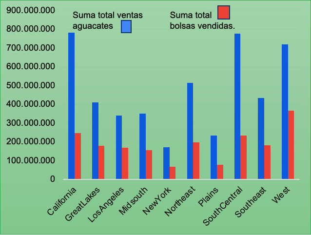
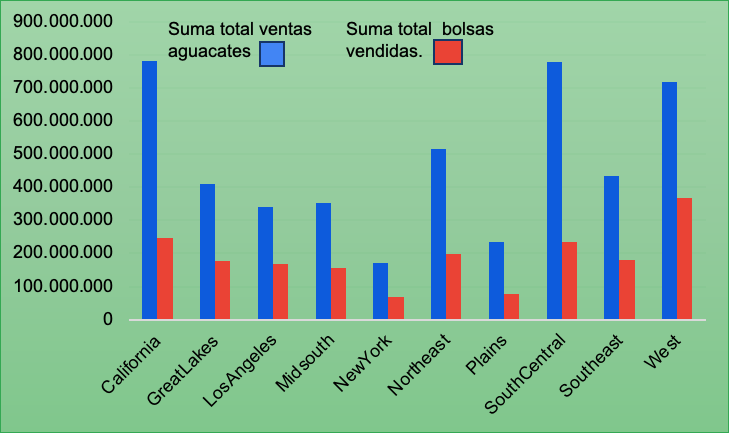
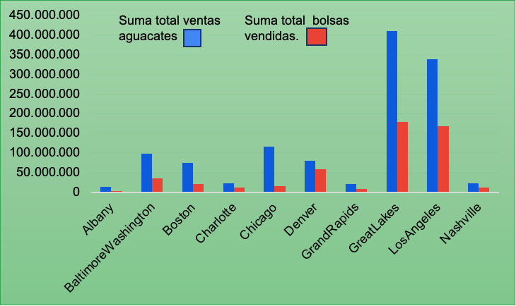

                  🥑 Análisis de Ventas de Aguacates en EE.UU. (2015-2018)

📊 Un estudio detallado sobre las tendencias de ventas, precios y preferencias en diferentes regiones.

📌 Introducción
Este proyecto analiza las ventas de aguacates en Estados Unidos entre 2015 y 2018, explorando cómo varían los precios, volúmenes vendidos y preferencias de compra según la región y el tipo de aguacate (convencional u orgánico).

 📈 Principales métricas:
✅ Precio promedio:$1.41  
✅ Precio mínimo y máximo: $0.44 - $3.25  
✅ Total de ventas en 3 años: 11,150 millones de libras  
✅ Región con mayores ventas: California (782.3 millones de libras)

🌎 Ventas por región
- California** lidera el mercado, seguida por el West y Southeast.
- Regiones con menor rendimiento: Albany, Syracuse y Roanoke.
- Las regiones costeras y del sur tienen mayor demanda debido a su clima y hábitos de consumo.

📦 Comparativa por tipo de bolsa y región
- Las Large Bags dominan las ventas en regiones de alto consumo como California.
- En regiones con menos ventas, los tamaños más pequeños son más populares.

💰 Tendencias de precios
- Los aguacates orgánicos tienen precios más altos y han mostrado un crecimiento sostenido.
- Los aguacates convencionales tienen precios más estables y accesibles.

🏆 Mejores y peores regiones en ventas
🔝 Top 10 Regiones 
🥇 California – Mayor mercado en volumen  
🥈 SouthCentral – Alto rendimiento  
🥉 We St – Demanda en áreas metropolitanas  

 📉 Peores 10 Regiones 
❌ Albany y Syracuse – Menor consumo  
❌ Regiones rurales con baja penetración de mercado  

📌 Conclusiones
1️⃣ California es la región dominante** en el mercado de aguacates.  
2️⃣ Los aguacates convencionales lideran las ventas, aunque los orgánicos están en crecimiento.  
3️⃣ Los precios de los aguacates orgánicos han aumentado por su demanda.  
4️⃣ Las bolsas grandes son más populares en regiones de alto volumen de ventas.  

🚀 Recomendaciones
✔️ Expandir estrategias de marketing en regiones de menor consumo.  
✔️ Aprovechar el crecimiento del mercado orgánico con promociones dirigidas.  
✔️ Optimizar empaques en función del tamaño de compra preferido por región.  

📋 Lista con las columnas que trae el Dataset así como una pequeña descripción de cada una:
-Index: Identificador único de cada registro en la base de datos.  
-Fecha: Fecha en la que se registraron los datos de venta de aguacates.  
-Precio Promedio: Precio promedio de venta por unidad de aguacate en la fecha registrada.  
-Volumen Total: Cantidad total de aguacates vendidos en la fecha registrada.  
-Ingreso Total: Ingresos totales generados por la venta de aguacates en la fecha indicada.  
-Numero total de aguacates con PLU 4046 vendidos: Cantidad de aguacates vendidos con el código PLU 4046, correspondiente a un tipo específico de aguacate.  
-Numero total de aguacates con PLU 4225 vendidos: Cantidad de aguacates vendidos con el código PLU 4225, correspondiente a otro tipo de aguacate.  
-Numero total de aguacates con PLU 4770 vendidos: Cantidad de aguacates vendidos con el código PLU 4770, representando otra variante de aguacate.  
-Total de aguacates vendidos: Suma total de todos los aguacates vendidos, independientemente de su código PLU.  
-Total bolsas: Número total de bolsas de aguacates vendidas en el periodo de tiempo indicado.  
-Bolsas Pequeñas: Cantidad de bolsas pequeñas de aguacates vendidas.  
-Bolsas Grandes: Cantidad de bolsas grandes de aguacates vendidas.  
-Bolsas extra grandes: Cantidad de bolsas extra grandes de aguacates vendidas.  
-Tipo de aguacate: Clasificación del aguacate vendido (convencional u orgánico).  
-Año: Año en el que se registraron las ventas de aguacates.  
-Region: Ubicación geográfica en la que se realizaron las ventas de aguacates.  

 📂 Datos y Referencias
- 📊 Base de datos: [Kaggle - Avocado Sales](https://www.kaggle.com/datasets/pedroisrael/avocado-sales)
- ✍️ Autor: Pedro Israel